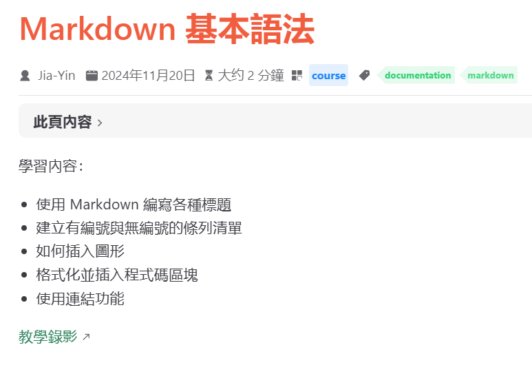

# 11020150.

[To do](todo.md)

- [X] First
- [ ] Second

1. First `print("Hello")`
3. Second
    - people
    - human



```python
def hello_world():
    print("Hello, World!")
```

[點擊這裡前往 Google](https://www.google.com)