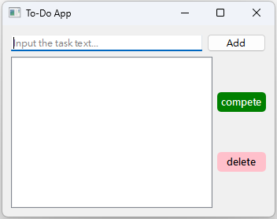

# todo_app 設置任務清單

這是一個可以設置自己的任務清單APP，也可點選任務選擇標記已完成或是刪除該任務。

## 功能
- 輸入任務名稱來新增任務。
- 選擇任務標記已完成。
- 刪除選擇的任務。

## 安裝
使用以下命令來安裝 PyQt6：

```
pip install PyQt6 pyqt6-tools
```

## 檢查 Qt Desginer
使用以下指令驗證 Qt Designer 是否可以執行：
```
pyqt6-tools designer
```
## 任務清單的圖形界面


## 保存文件
點擊 `File > Save As`，將文件保存為 `todo_app.ui`。

## 執行
```
python main.py
```
